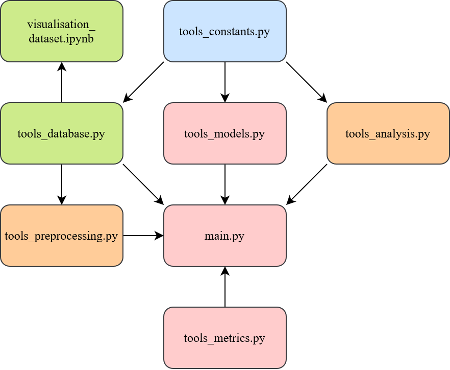

# TGV Delay prediction - TD3 Group 1

## Introduction

This project aims to predict through different Machine Learning approaches the arrival delay of the TGVs in France thanks to the database of the SNCF which we obtained at this [link](https://www.data.gouv.fr/fr/datasets/regularite-mensuelle-tgv-par-liaisons/). It also aims to predict the percentage of the different causes of delay. We consider in this project as a train base the data over the years 2018-2022, whereas the six first months of 2023 are used as the test base.

As the delay at arrival is a continuous feature, we addressed this problem as a regression one.

## Group composition

This project has been realized by:
- Salahidine LEMAACHI
- Laure-Emilie MARTIN
- Agathe PLU
- Ibrahim RAMDANE

## Project architecture

This project is composed of the following files and folders:
- `Data`, folder containing the dataset in `csv` format and the coordinates of the train stations.
- `figures`, folder containing the visualisation figures of the dataset, the correlation graphs and the graphical representations of our best results.
- `tools`, package containing the following modules:
  - `tools_analysis.py`, to analyse the correlation between the different features.
  - `tools_constants.py`, to set the main constants used in the project.
  - `tools_database.py`, to read the data and create some visualisations.
  - `tools_metrics.py`, containing the different metrics assessing the performances of the models.
  - `tools_models.py`, containing the different architectures we tested to solve our problem.
  - `tools_preprocessing.py`, containing the preprocessing pipeline on the data.
- `.gitignore`
- `main.py`, Python main script to launch the pipeline to solve the problem.
- `results.md`, Markdown file to store the best results we obtain.
- `visualisation_dataset.ipynb`, a Jupyter notebook which helps us to visualise the dataset.

The architecture of the code with the links between the different modules can be represented as followed:



## Installation

### Cloning the repository

To clone the github repository, you have to search the clone button on the main page of the project. Then click on it and select `https` or `ssh` depending on your favorite mode of connexion. Copy the given id and then open a terminal on your computer, go to the folder where you want to install the project and use the following command:

```bash
git clone <your copied content>
```

### Creation of a virtual environment

You might want to use a virtual environment to execute the code. To do so, use the following command:

```bash
python -m virtualenv venv
```

To start it, use the command on *Windows*:

```bash
venv/Scripts/Activate.ps1
```

Or for *MacOS* and *Linux*:

```bash
venv/Scripts/activate
```

### Installation of the necessary librairies

To execute our code, you need several *Python* librairies, specified in the `requirements.txt` file. To install them, use the following command:

```bash
pip install -r requirements.txt
```

## Utilisation

### Launch the main pipeline of training

To launch our code, you have to run the `main.py` file with the following command:

```bash
python main.py
```

This will run the whole pipeline with the best model we obtain. Nevertheless, if you want to change the model, go into the `main.py` file and change this line by passing as second parameter the model of your choice:

```python
complete_pipeline = make_pipeline(pipeline1, <model_of_your_choice>)
```

Most of the models we used are defined above this line and if you want, you may change the parameters. The complete descriptions of those models are written in the module `tools_models.py` where they are all defined.

At the end of the execution, six graphs will be saved in the folder `figures`, under the names `Predictions_month_i.png` where `i` is comprised between 1 and 6. This graphs represent the distribution of the predictions of the mean arrival delay according to the ground truth for each month of the year. These graphs may be compared to the graphs we obtained with the best models, saved under the names `Best_predictions_month_i.png`.

### Display the correlation graphs

By default the correlation graph and matrix are not displayed while launching the `main.py` as it takes some time to build them. Nevertheless, you can display them by setting the constant `TEST_MODE` to `True` in the module `tools_constants.py`. The correlation graphs will thus be built during the next execution of `main.py`.

### Dataset visualisations

To build the visualisation images of the dataset, you may run the Jupyter notebook `visualisation_dataset.ipynb`; this will provide you all the visualisations figures contained in the folder `figures` and some others.
